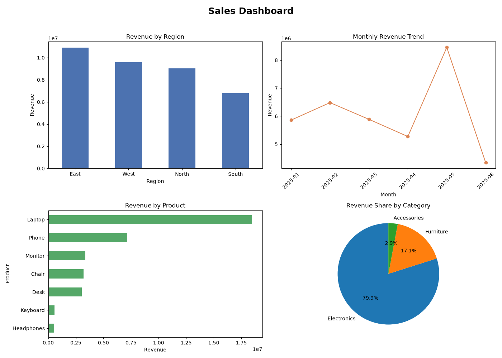

# Project 1 — Sales Dashboard 📊

**Module 3 · Data Analysis & Visualization**

A complete mini **Business Intelligence** pipeline — the daily work of a Data Analyst. It generates realistic sales data, analyzes it with **Pandas**, and builds a **4-chart dashboard** with **Matplotlib**, saved as a single image.

---

## ▶️ How to run

1. Install the libraries once:
   ```bash
   pip install pandas matplotlib
   ```
2. Open a terminal **in this folder** and run:
   ```bash
   python sales_dashboard.py
   ```
3. Open the generated **`sales_dashboard.png`**.

> Requires **Python 3.10+**. The sample `sales.csv` (400 rows) is auto-created on first run.

---

## 🖼️ Sample output



*(This image is a sample; the program regenerates it every run.)*

**Console summary:**
```
Total revenue : 36,296,000
Orders        : 400
Best region   : East
Best product  : Laptop
-> Open 'sales_dashboard.png' to view the dashboard.
```

---

## 🔄 The pipeline

```
create sample (NumPy) → load & clean (Pandas) → analyze (groupby) → visualize (Matplotlib) → save report
```

| Chart | Type | Shows |
|---|---|---|
| Revenue by Region | Bar | Which region sells most |
| Monthly Revenue Trend | Line | How sales change over time |
| Revenue by Product | Horizontal bar | Best/worst products |
| Revenue Share by Category | Pie | Category mix |

---

## 🧠 Concepts practised

| Concept | Where |
|---|---|
| NumPy random generator | creating the sample data |
| `pd.read_csv`, `to_datetime` | loading & cleaning |
| `groupby().sum()`, `sort_values` | aggregation |
| `.dt.to_period("M")` | monthly grouping |
| Matplotlib `subplots`, bar/line/barh/pie | the dashboard |

---

## 💡 Challenges

1. Add a **5th chart**: units sold by product (bar).
2. Add a **"Top salesperson"** column to the data and rank it.
3. Filter the dashboard to a **single region** chosen by the user.
4. Save each chart as its **own** PNG in addition to the combined dashboard.
