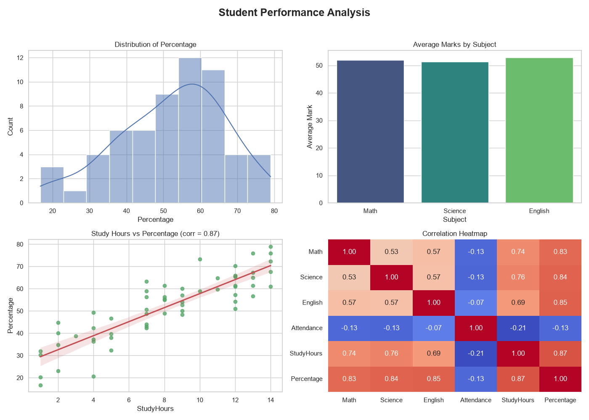

# Project 2 — Student Performance Analysis 🎓📈

**Module 3 · Data Analysis & Visualization**

A full **Exploratory Data Analysis (EDA)** of student exam performance using **Pandas, NumPy, and Seaborn** — putting AI-lifecycle stages *collect → clean → explore* into practice.

---

## ▶️ How to run

1. Install the libraries once:
   ```bash
   pip install pandas numpy seaborn matplotlib
   ```
2. Open a terminal **in this folder** and run:
   ```bash
   python student_performance_analysis.py
   ```
3. Open the generated **`performance_dashboard.png`**.

> Requires **Python 3.10+**. The sample `students.csv` (60 students, with a few missing marks on purpose) is auto-created on first run.

---

## 🖼️ Sample output



*(Sample image; regenerated every run.)*

**Console summary:**
```
Students        : 60
Overall average : 52.0%
Topper          : S01 (79.0%)
Passed / Failed : 39 / 21
Study vs marks  : correlation 0.87
```

The key insight the analysis surfaces: **study hours strongly correlate with marks (0.87)** — a lesson the data proves visually in the scatter plot and heatmap.

---

## 🔎 What the analysis does

| Step | Technique |
|---|---|
| Clean | fill missing marks with the subject **average** (`fillna`) |
| Summarize | `describe()`, subject averages, pass/fail |
| Relate | **correlation** between study hours and percentage |
| Compare | average percentage by **gender** (`groupby`) |
| Visualize | 4 Seaborn charts (below) |

| Chart | Seaborn function | Shows |
|---|---|---|
| Distribution of Percentage | `histplot` (+KDE) | spread of scores |
| Average Marks by Subject | `barplot` | which subject is hardest |
| Study Hours vs Percentage | `regplot` | the positive relationship |
| Correlation Heatmap | `heatmap` | how all variables relate |

---

## 🧠 Concepts practised

NumPy (correlated sample data) · Pandas (`fillna`, `groupby`, `corr`, `describe`) · missing-value handling · Seaborn (`histplot`, `barplot`, `regplot`, `heatmap`) · Matplotlib subplot grid.

---

## 💡 Challenges

1. Add an **Attendance vs Percentage** scatter — is attendance as important as study hours?
2. Add a **boxplot** of percentage by gender (`sns.boxplot`).
3. Flag the **bottom 5 students** who need help and save them to a CSV.
4. Change the missing-value strategy from *mean* to *median* and compare.
