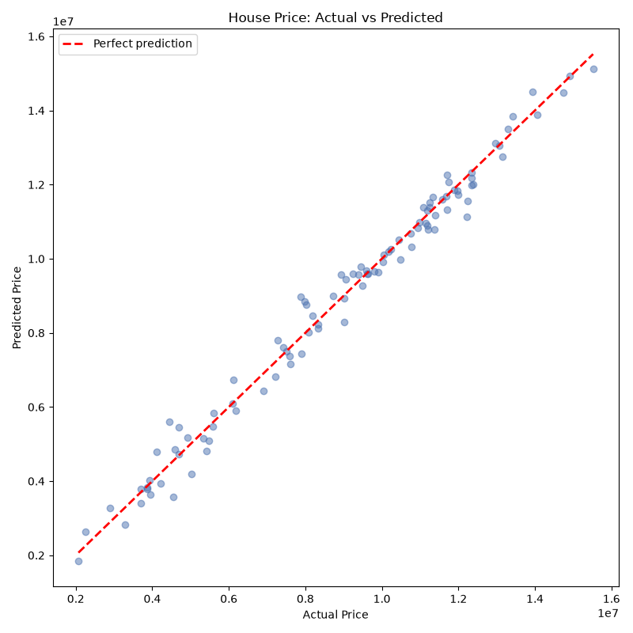

# Project 1 — House Price Prediction 🏠 (Regression)

**Module 4 · Machine Learning Essentials**

The "hello world" of Machine Learning: a **supervised regression** model that predicts a house **price** (a number) from its features, using **scikit-learn**.

---

## ▶️ How to run

1. Install once:
   ```bash
   pip install scikit-learn pandas numpy matplotlib
   ```
2. In this folder:
   ```bash
   python house_price_prediction.py
   ```
3. Open **`price_prediction.png`**.

> Requires **Python 3.10+**. The sample `houses.csv` (500 houses) is auto-created on first run.

---

## 🧠 The 4-line ML rhythm

Every scikit-learn model follows the same pattern — learn it once, use it forever:

```python
model = LinearRegression()          # 1. choose a model
model.fit(X_train, y_train)         # 2. train it
predictions = model.predict(X_test) # 3. predict
score = r2_score(y_test, predictions)  # 4. evaluate
```

---

## 🖼️ Sample output



*(Sample image; regenerated every run.)*

```
----- MODEL PERFORMANCE (on unseen test data) -----
MAE  (avg error)        : 312,196
RMSE (penalizes big miss): 407,108
R2   (0..1, higher better): 0.984  -> explains 98.4% of price variation

----- WHAT THE MODEL LEARNED (coefficients) -----
   Area              : +2,988 per unit
   Bedrooms          : +493,961 per unit
   Age               : -23,771 per unit
```

The closer the dots hug the red "perfect prediction" line, the better the model.

---

## 📖 What each metric means

| Metric | Meaning | Good value |
|---|---|---|
| **MAE** | Mean Absolute Error — average rupees off | lower |
| **RMSE** | Root Mean Squared Error — punishes big misses | lower |
| **R²** | Fraction of price variation explained (0–1) | closer to 1 |

---

## 🧩 Concepts practised

Supervised **regression** · features (X) vs label (y) · **one-hot encoding** of text (`pd.get_dummies`) · **train/test split** · `LinearRegression` · model **coefficients** · regression metrics (MAE, RMSE, R²).

---

## 💡 Challenges

1. Add a feature (e.g., `Bathrooms`) and see if R² improves.
2. Swap `LinearRegression` for `RandomForestRegressor` — does it beat the line?
3. Print the **5 worst predictions** (largest error) and inspect those houses.
4. Ask the user for a house's details and predict its price interactively.
