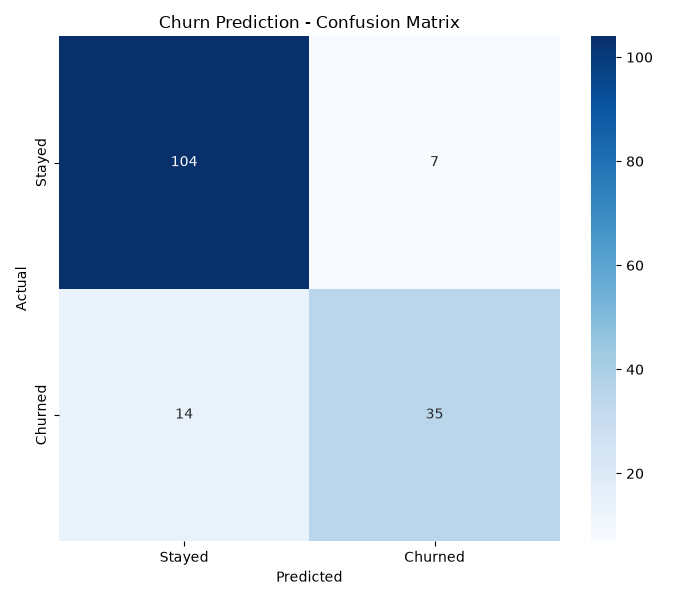

# Project 2 — Customer Churn Prediction 📉 (Classification)

**Module 4 · Machine Learning Essentials**

A **supervised classification** model that predicts whether a customer will **churn** (leave) — a Yes/No answer — using **Logistic Regression** in scikit-learn. One of the most valuable models in business.

---

## ▶️ How to run

1. Install once:
   ```bash
   pip install scikit-learn pandas numpy matplotlib seaborn
   ```
2. In this folder:
   ```bash
   python customer_churn_prediction.py
   ```
3. Open **`churn_confusion_matrix.png`**.

> Requires **Python 3.10+**. The sample `customers.csv` (800 customers, ~31% churn) is auto-created on first run.

---

## 🖼️ Sample output



*(Sample image; regenerated every run.)*

```
----- MODEL PERFORMANCE (on unseen test data) -----
Accuracy : 0.869
Precision: 0.833   (of those we flagged, how many really churned)
Recall   : 0.714   (of all real churners, how many we caught)
F1-score : 0.769

----- PREDICTION FOR A NEW CUSTOMER -----
Customer: 3 months tenure, $95/mo, 4 complaints, month-to-month
Prediction: WILL CHURN (churn probability 88%)
```

---

## 📖 Why accuracy isn't enough

If only 31% of customers churn, a lazy model that predicts "nobody churns" is **69% accurate** — but useless! That's why we also measure:

| Metric | Question it answers |
|---|---|
| **Precision** | Of those we *flagged*, how many really churned? |
| **Recall** | Of all *real* churners, how many did we catch? |
| **F1-score** | The balance of precision and recall |
| **Confusion matrix** | The full picture: TP, TN, FP, FN |

The **confusion matrix** shows exactly where the model is right and wrong:

```
                Predicted Stay   Predicted Churn
Actual Stay          TN (104)         FP (7)
Actual Churn         FN (14)          TP (35)
```

---

## 🧩 Concepts practised

Supervised **classification** · one-hot encoding + **feature scaling** (`StandardScaler`) · `train_test_split` with **stratify** · `LogisticRegression` in a **Pipeline** · classification metrics · **confusion matrix** · `predict_proba` (a probability, not just a label).

---

## 💡 Challenges

1. Swap `LogisticRegression` for `RandomForestClassifier` and compare F1.
2. Print each feature's influence (model coefficients) — what drives churn most?
3. Change the decision threshold from 0.5 to 0.3 — how do precision and recall shift?
4. List the 10 customers most at risk of churning (highest `predict_proba`).
