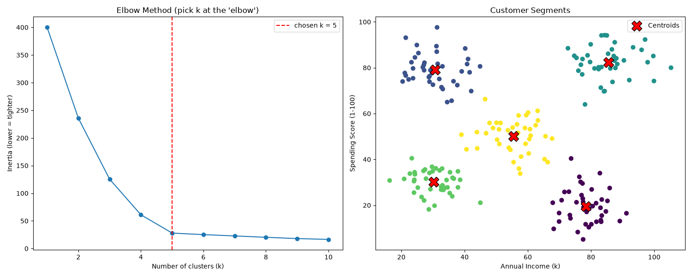

# Project 3 — Customer Segmentation 🎯 (Clustering)

**Module 4 · Machine Learning Essentials**

An **unsupervised clustering** model that groups customers into segments by income and spending — **without any labels**. The algorithm discovers the groups itself using **K-Means**. This is exactly how marketing teams find who to target.

---

## ▶️ How to run

1. Install once:
   ```bash
   pip install scikit-learn pandas numpy matplotlib
   ```
2. In this folder:
   ```bash
   python customer_segmentation.py
   ```
3. Open **`segments.png`**.

> Requires **Python 3.10+**. The sample `mall_customers.csv` (200 customers) is auto-created on first run.

---

## 🖼️ Sample output



*(Sample image; regenerated every run. Left: the Elbow Method. Right: the discovered segments with centroids.)*

```
----- CUSTOMER SEGMENTS FOUND -----
   Segment 0:  40 customers | avg income  78.4k | avg spend  19.6 | Savers (win them over)
   Segment 1:  40 customers | avg income  30.6k | avg spend  79.1 | Young Spenders
   Segment 2:  40 customers | avg income  85.6k | avg spend  82.4 | Premium (VIP - target!)
   Segment 3:  40 customers | avg income  30.3k | avg spend  30.1 | Budget
   Segment 4:  40 customers | avg income  55.5k | avg spend  50.2 | Average
```

---

## 📖 Key ideas

- **Unsupervised** = no "right answer" to learn from; the model finds structure on its own.
- **Feature scaling** matters: income (10–140) and spending (1–100) are put on the same scale so neither dominates the distance math.
- **The Elbow Method** helps choose `k` (the number of clusters): plot inertia vs k and pick the "elbow" where the curve flattens.
- **Centroids** are each cluster's center — the "average customer" of that segment.
- The real skill is **naming** the clusters — turning math into a business action.

---

## 🧩 Concepts practised

Unsupervised **clustering** · `StandardScaler` · `KMeans` (fit, labels, centroids, inertia) · the **Elbow Method** · interpreting & **naming** clusters.

---

## 💡 Challenges

1. Try `k = 3` and `k = 6` — how do the segments change?
2. Add a third feature (e.g., `Age`) and cluster in 3-D.
3. Compute the **silhouette score** (`sklearn.metrics.silhouette_score`) to measure cluster quality.
4. Write a one-line marketing action for each named segment.
