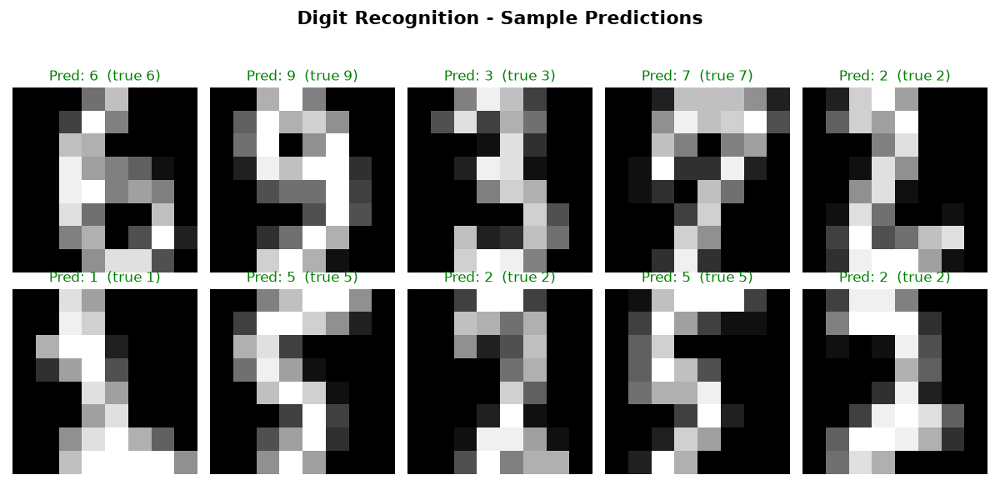

# Project 1 — Digit Recognition ✍️🔢 (Neural Network)

**Module 5 · Deep Learning & Computer Vision**

The classic first project of computer vision: train a **neural network** to recognize handwritten digits (0–9) from images. Each image is a small grid of pixels; the network learns to map those pixels to the right digit.

---

## ▶️ How to run

1. Install once:
   ```bash
   pip install scikit-learn matplotlib numpy
   ```
2. In this folder:
   ```bash
   python digit_recognition.py
   ```
3. Open **`digit_predictions.png`**.

> Requires **Python 3.x**. Runs instantly — no GPU, no heavy install. Uses scikit-learn's built-in `digits` dataset (1,797 images, 8×8 pixels).

---

## 🖼️ Sample output



*(Sample image; regenerated every run. Green title = correct, red = wrong.)*

```
Loaded 1797 images, each 8x8 pixels, labelled 0-9.
Training a neural network (2 hidden layers: 64 -> 32)...

Test accuracy: 0.981  (98.1% of digits correct)
Total misclassified: 7 out of 360 test images.
```

---

## 🧠 How it works

1. Each 8×8 image is **flattened** to 64 numbers (pixel brightness).
2. Those 64 inputs feed a **neural network** with two hidden layers (64 → 32 neurons).
3. The network learns weights (via gradient descent) that turn pixels into a digit 0–9.
4. It's a **multiclass classification** (10 classes) — evaluated with accuracy + a confusion matrix.

```
64 pixels  ->  [hidden layer 64]  ->  [hidden layer 32]  ->  10 outputs (0-9)
```

---

## 🔬 scikit-learn vs TensorFlow here

This project uses scikit-learn's `MLPClassifier` — a genuine neural network that runs **anywhere, instantly**. The **Module 5 notes (§4, §6)** show the same idea as a **Keras/TensorFlow CNN**, the industry standard for larger images (like the 28×28 MNIST set). The concepts — layers, neurons, training — are identical.

---

## 🧩 Concepts practised

Images as arrays of pixels · neural networks (input → hidden → output) · flattening · feature scaling · multiclass classification · confusion matrix.

---

## 💡 Challenges

1. Add a third hidden layer, or change the neuron counts — does accuracy change?
2. Print which digit pairs get confused most (read the confusion matrix).
3. Install TensorFlow (on Python ≤3.13 / Colab) and rebuild this as a **Keras CNN** on the full 28×28 MNIST dataset.
4. Save the trained model with `joblib` and load it to predict a single image.
