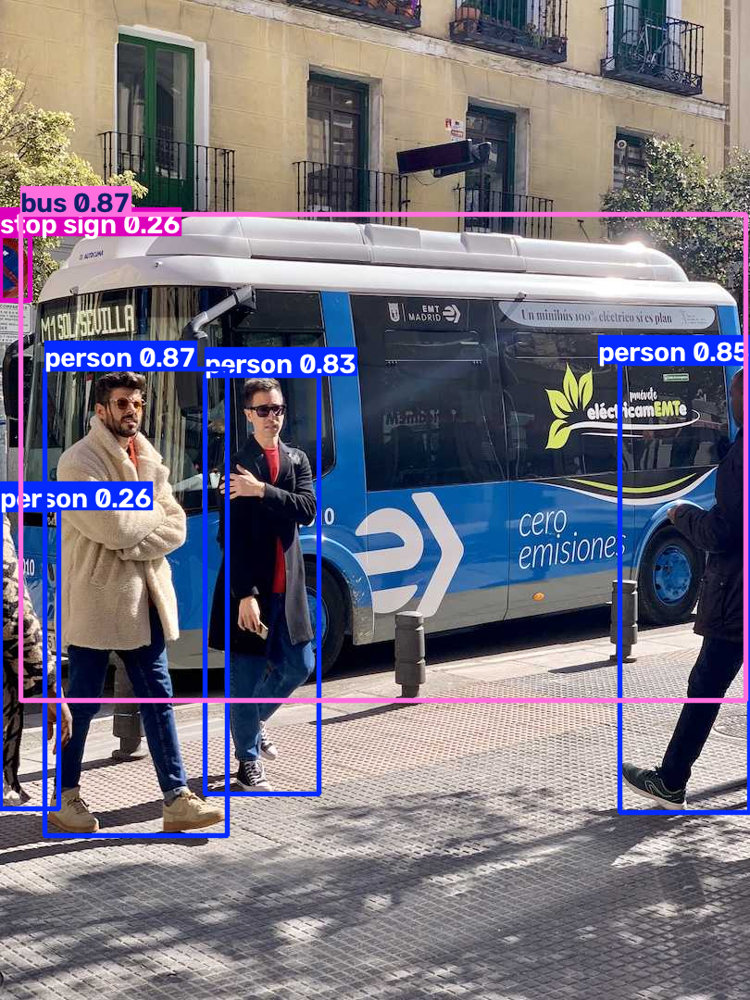

# Project 2 — Object Detection with YOLO 🎯📦

**Module 5 · Deep Learning & Computer Vision**

Use **YOLO** (You Only Look Once) — a state-of-the-art deep-learning detector — to find and label objects (people, cars, buses…) in an image, drawing a box around each. Unlike *classification* (which labels the whole image), **detection** finds *what* AND *where*.

---

## ▶️ How to run

1. Install once (this also installs PyTorch + OpenCV):
   ```bash
   pip install ultralytics
   ```
2. In this folder, run on the built-in sample image:
   ```bash
   python object_detection_yolo.py
   ```
   …or on **your own** image:
   ```bash
   python object_detection_yolo.py path/to/your_photo.jpg
   ```
3. Open **`detected_objects.png`**.

> **First run** downloads the model weights `yolov8n.pt` (~6 MB, needs internet, once). After that it works offline. Requires **Python 3.10+**.

---

## 🖼️ Sample output



*(Sample image; regenerated every run.)*

```
----- OBJECTS DETECTED -----
   bus          (confidence 87%)
   person       (confidence 87%)
   person       (confidence 85%)
   person       (confidence 83%)
   stop sign    (confidence 26%)

Summary (counts):
   4 x person
   1 x bus
   1 x stop sign
```

---

## 🧠 Key ideas

- **Classification vs Detection:** classification says "there's a bus"; detection says "there's a bus *here*, and 4 people *there*."
- **Pre-trained model:** `yolov8n.pt` already knows **80 common object classes** (from the COCO dataset) — you don't train anything; you *use* a model someone else trained (transfer learning, §10 in the notes).
- **"You Only Look Once":** YOLO does detection in a **single fast pass** over the image, which is why it's fast enough for real-time video.
- Each detection has a **bounding box**, a **class label**, and a **confidence** score.

---

## 🧩 Concepts practised

Object detection vs image classification · using a pre-trained deep-learning model · bounding boxes, labels, confidence scores · the YOLO idea.

---

## 💡 Challenges

1. Run it on your **own photos** — how many objects can it find?
2. Try a bigger model for higher accuracy: change `"yolov8n.pt"` to `"yolov8s.pt"` or `"yolov8m.pt"`.
3. Count only **people** in an image (filter detections by class).
4. Run detection on a **video** file (`model.predict(source="video.mp4")`).
