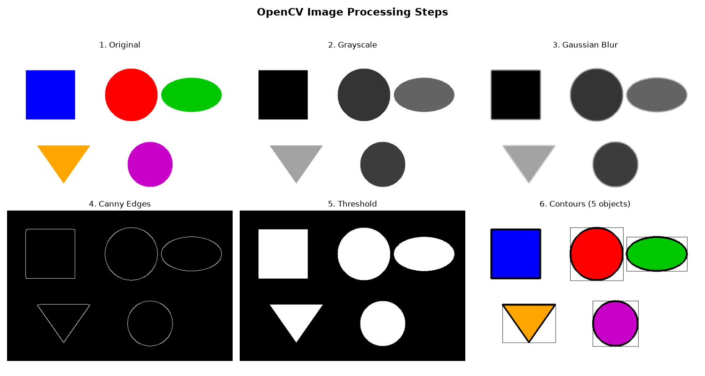

# Project 3 — OpenCV Image Processing 🖼️🔧

**Module 5 · Deep Learning & Computer Vision**

Computer Vision starts with **image processing** — the classic **OpenCV** operations every vision system uses *before* any deep learning. This toolkit creates a sample image and applies the core operations side by side.

---

## ▶️ How to run

1. Install once:
   ```bash
   pip install opencv-python numpy matplotlib
   ```
2. In this folder:
   ```bash
   python opencv_image_processing.py
   ```
3. Open **`processing_steps.png`**.

> Requires **Python 3.x**. No display needed — it saves the result to a PNG (uses `cv2.imwrite` / matplotlib, never `cv2.imshow`).

---

## 🖼️ Sample output



*(Sample image; regenerated every run.)*

The montage shows all six steps applied to a generated image of 5 shapes.

---

## 🔧 The six operations

| # | Operation | OpenCV function | What it does |
|---|---|---|---|
| 1 | Original | — | The starting color image (BGR) |
| 2 | **Grayscale** | `cvtColor(..., BGR2GRAY)` | Drop color, keep brightness |
| 3 | **Gaussian Blur** | `GaussianBlur` | Smooth out noise |
| 4 | **Canny Edges** | `Canny` | Find outlines |
| 5 | **Threshold** | `threshold` | Pure black/white image |
| 6 | **Contours** | `findContours` | Detect & count objects (found **5**) |

---

## 🧠 Key ideas

- **An image is a NumPy array** of pixels — Module 3 pays off here! A color image has shape `(height, width, 3)`.
- **OpenCV uses BGR order** (Blue, Green, Red), not RGB — a classic gotcha when displaying with Matplotlib (convert with `cvtColor(..., BGR2RGB)`).
- These operations are the **preprocessing** that feeds into deep-learning vision models.

---

## 🧩 Concepts practised

Images as NumPy arrays · color spaces (BGR/RGB/gray) · blurring · edge detection (Canny) · thresholding · contours (object detection & counting).

---

## 💡 Challenges

1. Load one of **your own** images (`cv2.imread("photo.jpg")`) instead of the generated one.
2. Add **face detection** using OpenCV's built-in Haar cascade (`cv2.CascadeClassifier`).
3. Rotate, resize, and crop the image (`cv2.resize`, `cv2.warpAffine`).
4. Print the **area** of each detected contour and label the largest shape.
