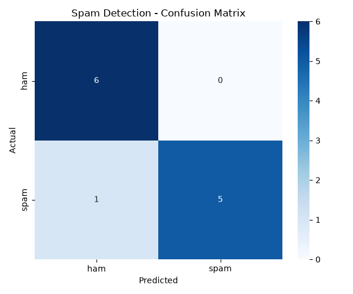

# Project 1 — Spam Detection 📧🚫 (Text Classification)

**Module 6 · Natural Language Processing**

The classic first NLP project: an **spam filter** that reads a text message and decides **SPAM** or **HAM** (not spam) — the same idea behind your email's spam folder. Built with **TF-IDF + Naive Bayes**.

---

## ▶️ How to run

1. Install once:
   ```bash
   pip install scikit-learn matplotlib seaborn
   ```
2. In this folder:
   ```bash
   python spam_detection.py
   ```
3. Open **`spam_confusion_matrix.png`**.

> Requires **Python 3.x**. The labelled dataset is built into the script (self-contained).

---

## 🖼️ Sample output



*(Sample image; regenerated every run.)*

```
Dataset: 40 messages (20 spam, 20 ham).
Vocabulary size: 195 words. Each message -> a 195-number vector.

Accuracy: 0.917

Top words the model treats as SPAM signals:
   free, limited, claim, account, offer, details, week, cheap, text, win

----- PREDICTIONS ON NEW MESSAGES -----
   [SPAM] ( 62% spam)  Congratulations! Claim your FREE prize money now...
   [ham ] ( 36% spam)  Hey, can we reschedule our call to 3pm tomorrow?...
   [SPAM] ( 64% spam)  URGENT: verify your bank account or it will be...
   [ham ] ( 43% spam)  Thanks for the notes, see you in class on Monday...
```

The model even tells you **why** — the words it associates with spam (free, claim, offer, win…) are exactly what you'd expect.

---

## 🧠 How it works

1. **TF-IDF** turns each message into a vector of numbers (a model can't read words). Common words count little; distinctive words count a lot.
2. **Naive Bayes** — a fast, probability-based classifier that works beautifully on text — learns which words signal spam.
3. Evaluated with **accuracy + precision/recall + a confusion matrix** (Module 4 skills, applied to text).

---

## 🧩 Concepts practised

Text preprocessing (lowercasing, stop-word removal via TF-IDF) · Bag-of-words / **TF-IDF** · text classification with **Naive Bayes** · confusion matrix · model interpretation (spammy words).

---

## 💡 Challenges

1. Add your own spam/ham messages to the dataset — does accuracy change?
2. Swap `MultinomialNB` for `LogisticRegression` and compare.
3. Add `ngram_range=(1,2)` to the vectorizer to capture 2-word phrases.
4. Download a real dataset (e.g., the SMS Spam Collection on Kaggle) and retrain.
