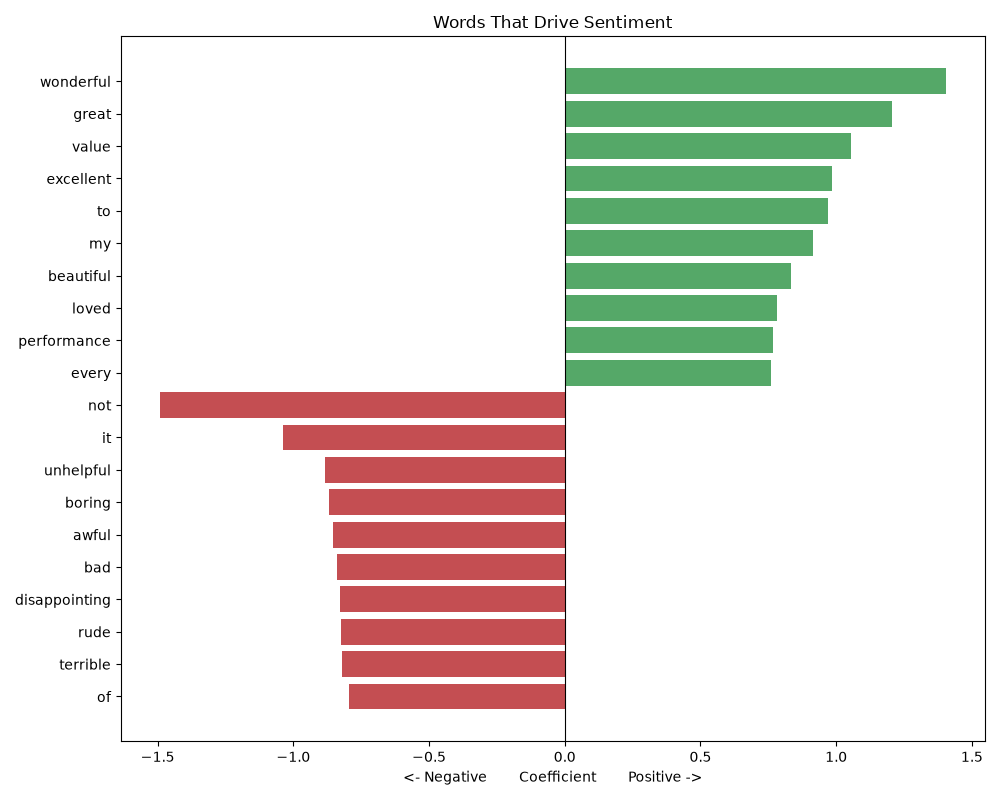

# Project 2 — Sentiment Analysis 😀😞

**Module 6 · Natural Language Processing**

An NLP model that reads a review and decides if the sentiment is **POSITIVE** or **NEGATIVE** — the tool companies use to understand feelings across thousands of reviews, tweets, and support tickets. Built with **TF-IDF + Logistic Regression**.

---

## ▶️ How to run

1. Install once:
   ```bash
   pip install scikit-learn matplotlib
   ```
2. In this folder:
   ```bash
   python sentiment_analysis.py
   ```
3. Open **`sentiment_words.png`**.

> Requires **Python 3.x**. The labelled dataset is built in.

---

## 🖼️ Sample output



*(Sample image; regenerated every run. Green = positive words, red = negative.)*

```
Dataset: 60 reviews (30 positive, 30 negative).
Accuracy: 0.722

Most POSITIVE words: wonderful, great, value, excellent, beautiful, loved ...
Most NEGATIVE words: not, unhelpful, boring, awful, bad, disappointing ...

----- PREDICTIONS ON NEW REVIEWS -----
   [POSITIVE] ( 63% positive)  This is the best thing I have ever bought...
   [NEGATIVE] ( 26% positive)  What a horrible waste of time, I want a refund...
   [POSITIVE] ( 74% positive)  The design is beautiful and it works great...
   [NEGATIVE] ( 33% positive)  Cheap, broken and completely useless...
```

---

## 💡 The one NLP subtlety this project teaches

> **Never remove "not" for sentiment!** Standard preprocessing strips stop words like *the, is, and* — but *not, no, never* **flip meaning** ("not good" ≠ "good"). This project **keeps** those words and adds **bigrams** (2-word phrases) so "not good" is learned as one signal. Notice **"not"** is the model's strongest *negative* word in the chart.

---

## 🧠 Why is accuracy "only" 72%?

Sentiment is genuinely **harder** than spam — positive and negative reviews share many words, and 60 examples is tiny. Real sentiment models train on **thousands** of reviews and reach 85–95%. With this small set, the *new-review predictions are all correct*, which is what matters for learning. **More data = higher accuracy** (try it!).

---

## 🧩 Concepts practised

Sentiment analysis · TF-IDF with **bigrams** · handling **negation** · Logistic Regression for text · reading model coefficients · `predict_proba` confidence.

---

## 💡 Challenges

1. Add 40 more reviews and watch accuracy climb.
2. Add a third class, **"neutral"**, and see how the model copes.
3. Use a real dataset (IMDB movie reviews) for a big accuracy boost.
4. Compare against a simple word-list (lexicon) approach — which wins?
