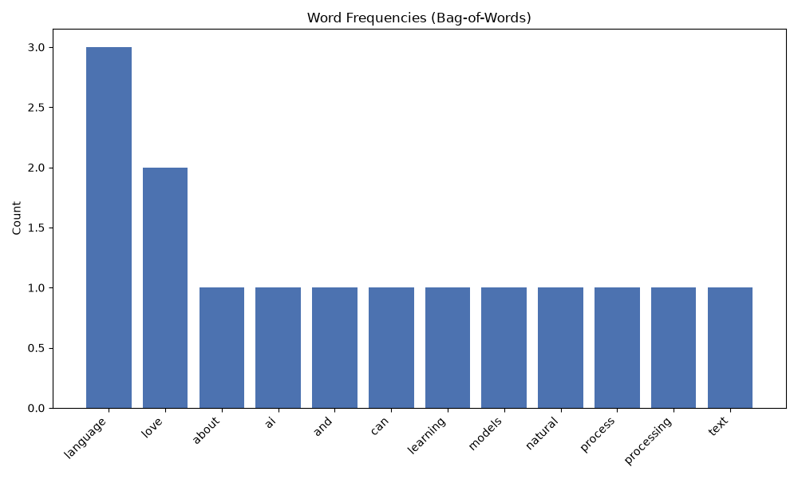

# Project 3 — Text Preprocessing Toolkit 🧹🔤

**Module 6 · Natural Language Processing**

Before any NLP model can work, raw text must be **cleaned** and turned into **numbers**. This toolkit walks through every core preprocessing step — showing the text *before and after* — then converts sentences into **Bag-of-Words** and **TF-IDF** vectors, the exact technique Projects 1 and 2 rely on.

---

## ▶️ How to run

1. Install once:
   ```bash
   pip install scikit-learn matplotlib
   ```
2. In this folder:
   ```bash
   python text_preprocessing.py
   ```
3. Open **`word_frequencies.png`**.

> Requires **Python 3.x**. Fully self-contained (no data files, no downloads).

---

## 🔤 The preprocessing pipeline

```
raw text
  → [1] lowercase        "AI" and "ai" become the same
  → [2] remove punctuation & numbers
  → [3] tokenize          split into a list of words
  → [4] remove stop words drop "the", "is", "and"
  → [5] stem              "learning" → "learn"
  → [6] Bag-of-Words      count each word
  → [7] TF-IDF            weight distinctive words higher
  → numbers a model can learn from!
```

---

## 🖼️ Sample output



*(Sample image; regenerated every run.)*

```
[3] Tokenized (28 tokens): ['natural', 'language', 'processing', 'is', ...]
[4] Stop words removed (20 tokens): ['natural', 'language', 'processing', ...]
[5] Stemmed: ['natural', 'language', 'process', 'amaz', 'ai', 'system', ...]

[7] TF-IDF (importance weights) for sentence 1:
   natural     : 0.58
   processing  : 0.58
   love        : 0.44
   language    : 0.35
```

---

## 🧠 Key ideas

- **Tokenization** = splitting text into words (tokens).
- **Stop words** = common low-meaning words removed to reduce noise.
- **Stemming** = chopping words to a root so *learning/learned/learns* match (this demo uses a simplified stemmer; real ones like **Porter** are smarter).
- **Bag-of-Words** = represent text by *word counts* (ignores order).
- **TF-IDF** = Bag-of-Words but rare, distinctive words weigh more — your first taste of turning words into meaningful numbers ("embeddings 101").

---

## 🧩 Concepts practised

The full text-preprocessing pipeline · tokenization · stop words · stemming · Bag-of-Words (`CountVectorizer`) · **TF-IDF** (`TfidfVectorizer`).

---

## 💡 Challenges

1. Paste in your own paragraph and watch each step transform it.
2. Install NLTK and swap the simple stemmer for the real **PorterStemmer**.
3. Add **lemmatization** (smarter than stemming — "better" → "good").
4. Print the full TF-IDF matrix for all three sentences as a table.
